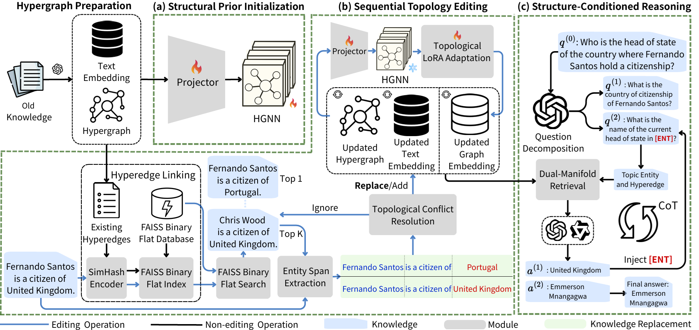

# HyperPatch

Official resources of **"HyperPatch: Sequential Knowledge Editing Under 𝑛-ary Structural Drift"**. Yu-Kai Chan, Wen-Sheng Lien, Dong-Ting Yao, Bo-Kai Ruan, Kwan-Yeung Lin, Hong-Han Shuai, Meng-Fen Chiang.

> Accepted at **ACM SIGKDD Conference on Knowledge Discovery and Data Mining (KDD) 2026** 

[](https://doi.org/10.5281/zenodo.20372801)
[](https://www.python.org/downloads/)
[](LICENSE)

##  Overview 



## Project Structure

```text
HyperPatch/
├── datasets/
│   ├── knowledge/
│   ├── questions/
│   ├── MQuAKE-CF-3k-v2.json
│   └── MQuAKE-T.json
├── hypergraphrag/
│   ├── kg/
│   ├── base.py
│   ├── GNN_LoRA_finetune.py
│   ├── GNN_model.py
│   ├── graphml_loader.py
│   ├── hypergraphrag.py
│   └── ...
├── Output/
│   ├── 1_edited_hybrid/
│   ├── 100_edited_hybrid/
│   ├── All_edited_hybrid/
│   └── ...
├── prompts/
├── .env
├── evaluation.py
├── full_pipe.py
├── GNN_pretrain.py
├── eval.sh
├── run.sh
└── requirements.txt
```
## Datasets

This project uses the [MQuAKE](https://github.com/princeton-nlp/MQuAKE) benchmark for evaluating knowledge editing under multi-hop question answering settings. MQuAKE contains counterfactual editing cases and temporal knowledge update cases, which are used to test whether edited knowledge can be correctly propagated to multi-hop reasoning questions.

Please place the required dataset files under the `datasets/` directory:

```text
datasets/
├── MQuAKE-CF-3k-v2.json
└── MQuAKE-T.json
```

## Environment Setup

Create and activate a conda environment:

```bash
conda create -n hyperpatch python=3.11 -y
conda activate hyperpatch
```

Install the required packages:

```bash
pip install -r requirements.txt
python -m spacy download en_core_web_lg
```

## Configuration

Create a `.env` file in the project root and add your OpenAI API key:

```bash
OPENAI_API_KEY=YOUR_OPENAI_API_KEY
```

## Data Preprocessing

Before preprocessing the datasets, adjust the number of workers in `datasets/preprocess.py` according to your machine resources:

```python
MAX_WORKERS = 64  # default
```

Then run the preprocessing script:

```bash
cd datasets
python preprocess.py
cd ..
```

## Main Experiment

Select the dataset and configure the experimental setting in `run.sh`:

```bash
DATASET_NAME="MQuAKE-T"  # "MQuAKE-T" or "MQuAKE-CF-3k-v2"
```

Run the main experiment from the project root:

```bash
bash run.sh
```

## Evaluation

After the experiment finishes, copy the path of `all_results.json` from the `Output/` directory and set it in `eval.sh`.

For example:

```bash
PRED_PATH="Output/1_edited_hybrid/all_results.json"
```

Then run:

```bash
bash eval.sh
```

## Citation

If you find this repository useful, please cite our work:

```bibtex
@inproceedings{chan2026hyperpatch,
    title = {HyperPatch: Sequential Knowledge Editing Under {n}-ary Structural Drift},
    author = {Chan, Yu-Kai and Lien, Wen-Sheng and Yao, Dong-Ting and Ruan, Bo-Kai and Lin, Kwan-Yeung and Shuai, Hong-Han and Chiang, Meng-Fen},
    booktitle = {Proceedings of the 32nd ACM SIGKDD Conference on Knowledge Discovery and Data Mining},
    year = {2026}
}
```
## License

This project is licensed under the **MIT License** — see the [LICENSE](LICENSE) file for details.

## Acknowledgement

This repo benefits from [HyperGraphRAG](https://github.com/LHRLAB/HyperGraphRAG) and [GraphLoRA](https://github.com/AllminerLab/GraphLoRA).  Thanks for their wonderful works.
